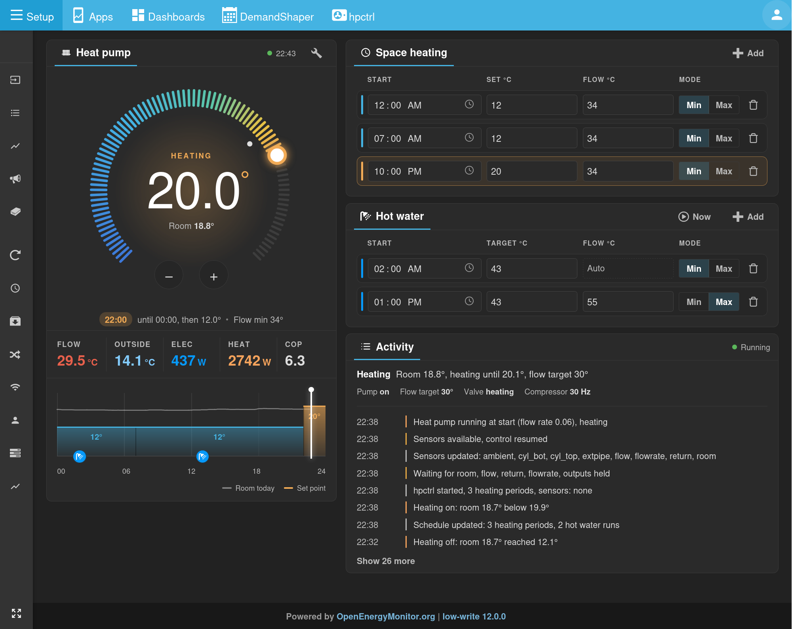

# Heat pump control

Schedule based control of a 5kW Mitsubishi Ecodan via its CN105 port, running on an emonPi alongside emoncms.



- Room thermostat with a time-of-day setpoint schedule
- Low temperature "min" flow mode that tracks return temperature + a small dT, or a fixed "max" flow temperature
- Scheduled domestic hot water (DHW) runs via a 3-way valve relay
- Frost protection pump cycling based on external pipe temperature
- emoncms web UI for the schedule, with live flow, outside, electric, heat and COP
- Activity panel showing what the service is doing and why, with a log of recent events
- Control inputs chosen from emoncms inputs in the UI, with stale value detection
- Control parameters (thermostat hysteresis, Min mode curve, hot water, frost protection) tunable in the UI
- Hot water run on demand from the UI
- Commands checked against what the Ecodan reports back over CN105, and resent if lost
- Controller targets logged to emoncms for graphing against what the heat pump actually did

## How it fits together

```
 emoncms UI (hpctrl-module)
   │ published to MQTT, retained: hpctrl/config (schedule), hpctrl/inputs
   │ (input ids), hpctrl/params (control parameters); not retained:
   │ hpctrl/command (hot water now / stop)
   ▼
 service/hpctrl.py ─── one process, every 10 s ───────────────────────────
   │  inputs.py      read input:lastvalue:<id> from Redis (emoncms inputs)
   │  controller.py  thermostat, flow target, hot water, frost protection
   │  hardware.py    power + flow temperature to the Ecodan over CN105 (cn105.py),
   │                 poll its readings, resend commands it hasn't taken up
   │  GPIO 27        3-way valve: heating / hot water
   ▼
 Redis hpctrl:status + hpctrl:events ──► UI Activity panel (hpctrl/status)
 MQTT emon/hpmon5/mode*               ──► emoncms (heating/hot water split)
 Redis emonhub:sub                    ──► emonhub (Ecodan CN105 readings)
```

The controller is pure logic with no I/O, so its behaviour is covered by tests that need no hardware:

    python3 -m unittest discover tests

### Control inputs

Chosen in the UI settings page (wrench icon) under Control inputs. A value older than 10 minutes (room: 30 minutes) counts as missing:

| Input | Required | When missing |
|---|---|---|
| Room temperature | yes | assumes 10°, so heating stays on |
| Flow, return temperature, flow rate | yes | control waits and outputs are held |
| Cylinder top, bottom | for hot water | a hot water run stops, or is skipped |
| External pipe | no | if chosen, assumed freezing (pump cycles); if not used, no frost protection |
| Outside temperature | no | logged only |

### Redis keys

emoncms's Redis prefix (`[redis] prefix` in its settings) applies to the first three; the service reads it from `/var/www/emoncms`.

| Key | Written by | Read by |
|---|---|---|
| `input:lastvalue:<id>` | emoncms | service, control inputs |
| `hpctrl:status` | service | UI, current state, reason, outputs, input ages, Ecodan readings |
| `hpctrl:events` | service | UI, last 200 events |
| `emonhub:sub` | service | emonhub, Ecodan readings as node `ecodan` and controller targets as node `hpctrl` |

### Feeds for tuning

Node `hpctrl` appears in emoncms inputs with the controller's view of things every 10 s. Log the ones you want to feeds:

| Input | |
|---|---|
| `set_point`, `flowT_target` | room set point and the flow temperature sent to the Ecodan |
| `power`, `valve`, `mode` | pump on, valve to hot water, 0 off / 1 heating / 2 hot water |
| `heating`, `frost` | heating cycle and frost protection active |
| `dhw_target` | target of the hot water run in progress, else 0 |
| `verified` | 0 while the Ecodan disagrees with a command sent |

## Directory layout

```
hpctrl-module/   emoncms web module, symlinked to /var/www/emoncms/Modules/hpctrl
service/         hpctrl.py (the service), controller.py, inputs.py, hardware.py, cn105.py
tests/           controller and command verification tests
systemd/         unit template and install script
config/          *.default / *.example files are tracked, local copies are gitignored
tools/           CN105 debugging and bench scripts (stop the service first: one serial port)
archive/         earlier versions, including the three-service setup this replaced
docs/
```

## Install

Web module:

    ln -s /opt/emoncms/modules/hpctrl/hpctrl-module /var/www/emoncms/Modules/hpctrl

Then run Admin > Update database in emoncms to create the `hpctrl` table.

Local config, all optional:

    cp config/ui_settings.default.php config/ui_settings.php   # emoncms user ids allowed to use the UI
    cp config/mqtt.example.json config/mqtt.json              # only if not using emonSD MQTT defaults

Service:

    ./systemd/install_service.sh hpctrl

Then open the UI, settings, and choose the control inputs. Until they are chosen the service waits and leaves the heat pump as it is.

Logs: `sudo journalctl -f -u hpctrl -o cat`

### Dry run

    python3 service/hpctrl.py --dry-run

Runs the controller without touching the serial port or relay and without publishing to MQTT. Decisions are logged and shown in the UI Activity panel, marked Dry run. Useful for checking inputs and behaviour before handing over control.

The service keeps a copy of the last schedule, inputs and control parameters it received in `config/schedule.json`, `config/inputs.json` and `config/params.json`, so it starts with them even if MQTT is down.

## Schedule format

The UI writes this for you; see [config/schedule.example.json](config/schedule.example.json). `start` is `HHMM`. The period in force is the last one whose start has passed, wrapping round from the previous day. A hot water run starts once a day within 5 minutes of its `start` and stops once the cylinder top reaches `T` and the bottom is within 3° of it.

## CN105 serial port

`service/cn105.py` defaults to the CP2102 adapter's `/dev/serial/by-id/...` path, which is stable across reboots. If you use a different adapter, change `DEFAULT_PORT` there. To read the heat pump directly:

    python3 tools/readinfo.py
